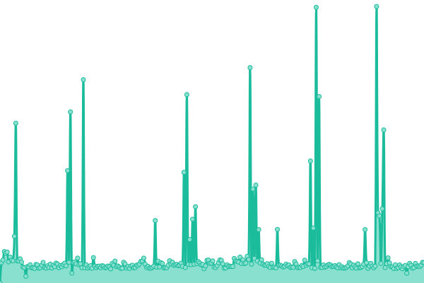

# [📈 Live Status](https://efecear.github.io/upptime): <!--live status--> **🟧 Partial outage**

This repository contains the open-source uptime monitor and status page for [efecear](https://efecear.github.io/upptime), powered by [Upptime](https://github.com/upptime/upptime).

With [Upptime](https://upptime.js.org), you can get your own unlimited and free uptime monitor and status page, powered entirely by a GitHub repository. We use [Issues](https://github.com/efecear/upptime/issues) as incident reports, [Actions](https://github.com/efecear/upptime/actions) as uptime monitors, and [Pages](https://efecear.github.io/upptime) for the status page.

<!--start: status pages-->
<!-- This summary is generated by Upptime (https://github.com/upptime/upptime) -->
<!-- Do not edit this manually, your changes will be overwritten -->
<!-- prettier-ignore -->
| URL | Status | History | Response Time | Uptime |
| --- | ------ | ------- | ------------- | ------ |
|  [efece.ar](https://www.efece.ar) | Caido | [efece-ar.yml](https://github.com/efecear/upptime/commits/HEAD/history/efece-ar.yml) | 

 4191ms
     
 | 

<a href="https://estado.efece.ar/history/efece-ar">99.25%</a>
    

|  [Sandra Luna](https://www.sandraluna.com.ar) | En Linea | [sandra-luna.yml](https://github.com/efecear/upptime/commits/HEAD/history/sandra-luna.yml) | 

 6278ms
     
 | 

<a href="https://estado.efece.ar/history/sandra-luna">100.00%</a>
    

|  [Huella Sagrada](http://huellasagrada.com.ar) | Caido | [huella-sagrada.yml](https://github.com/efecear/upptime/commits/HEAD/history/huella-sagrada.yml) | 

 2876ms
     
 | 

<a href="https://estado.efece.ar/history/huella-sagrada">99.26%</a>
    

|  [La Semilla Que Crece](https://www.lasemillaquecrece.com.ar) | Caido | [la-semilla-que-crece.yml](https://github.com/efecear/upptime/commits/HEAD/history/la-semilla-que-crece.yml) | 

 2549ms
     
 | 

<a href="https://estado.efece.ar/history/la-semilla-que-crece">99.78%</a>
    

|  [Maiá Noé](https://www.maianoe.com.ar) | Caido | [maia-noe.yml](https://github.com/efecear/upptime/commits/HEAD/history/maia-noe.yml) | 

 6538ms
     
 | 

<a href="https://estado.efece.ar/history/maia-noe">99.79%</a>
    

|  [Almacén BioPandora](https://www.biopandora.com.ar) | Caido | [almacen-bio-pandora.yml](https://github.com/efecear/upptime/commits/HEAD/history/almacen-bio-pandora.yml) | 

 3319ms
     
 | 

<a href="https://estado.efece.ar/history/almacen-bio-pandora">99.81%</a>
    

|  [Afip Api Facturador](https://afip.dev) | En Linea | [afip-api-facturador.yml](https://github.com/efecear/upptime/commits/HEAD/history/afip-api-facturador.yml) | 

 159ms
     
 | 

<a href="https://estado.efece.ar/history/afip-api-facturador">100.00%</a>
    

|  [UTT Nodo Morón](https://www.uttnodomoron.com.ar) | Caido | [utt-nodo-moron.yml](https://github.com/efecear/upptime/commits/HEAD/history/utt-nodo-moron.yml) | 

 3529ms
     
 | 

<a href="https://estado.efece.ar/history/utt-nodo-moron">99.64%</a>
    

|  [Casa A](http://nodocasaa.com.ar) | Caido | [casa-a.yml](https://github.com/efecear/upptime/commits/HEAD/history/casa-a.yml) | 

 4801ms
     
 | 

<a href="https://estado.efece.ar/history/casa-a">99.48%</a>
    

|  [Tierra Firme](https://www.tierrafirmenodoutt.com.ar) | Caido | [tierra-firme.yml](https://github.com/efecear/upptime/commits/HEAD/history/tierra-firme.yml) | 

 6001ms
     
 | 

<a href="https://estado.efece.ar/history/tierra-firme">99.70%</a>
    

|  [Nodo UTT Ramos Mejia](https://www.uttnodoramosmejia.com.ar) | Caido | [nodo-utt-ramos-mejia.yml](https://github.com/efecear/upptime/commits/HEAD/history/nodo-utt-ramos-mejia.yml) | 

 5938ms
     
 | 

<a href="https://estado.efece.ar/history/nodo-utt-ramos-mejia">99.88%</a>
    

|  [Vía Judicial](https://www.viajudicial.com.ar) | En Linea | [via-judicial.yml](https://github.com/efecear/upptime/commits/HEAD/history/via-judicial.yml) | 

 1034ms
     
 | 

<a href="https://estado.efece.ar/history/via-judicial">100.00%</a>
    

|  [Veterinaria Colonia Animal](https://www.coloniaanimal.com) | Caido | [veterinaria-colonia-animal.yml](https://github.com/efecear/upptime/commits/HEAD/history/veterinaria-colonia-animal.yml) | 

 3306ms
     
 | 

<a href="https://estado.efece.ar/history/veterinaria-colonia-animal">99.89%</a>
    

|  [Jorge Retamoza Web](https://www.retamoza.com.ar) | Caido | [jorge-retamoza-web.yml](https://github.com/efecear/upptime/commits/HEAD/history/jorge-retamoza-web.yml) | 

 2986ms
     
 | 

<a href="https://estado.efece.ar/history/jorge-retamoza-web">99.91%</a>
    

|  [Almacenata](https://www.almacenata.com.ar) | Caido | [almacenata.yml](https://github.com/efecear/upptime/commits/HEAD/history/almacenata.yml) | 

 3976ms
     
 | 

<a href="https://estado.efece.ar/history/almacenata">94.61%</a>
    

|  [Granja Cooperativa La Tandilera](https://www.latandilera.com.ar) | Caido | [granja-cooperativa-la-tandilera.yml](https://github.com/efecear/upptime/commits/HEAD/history/granja-cooperativa-la-tandilera.yml) | 

 3867ms
     
 | 

<a href="https://estado.efece.ar/history/granja-cooperativa-la-tandilera">99.57%</a>
    

|  [Nodo Monte Castro](https://nodomontecastro.com.ar) | Caido | [nodo-monte-castro.yml](https://github.com/efecear/upptime/commits/HEAD/history/nodo-monte-castro.yml) | 

 9867ms
     
 | 

<a href="https://estado.efece.ar/history/nodo-monte-castro">88.75%</a>
    

|  [DNS-1](ns3.hostmar.com) | Caido | [dns-1.yml](https://github.com/efecear/upptime/commits/HEAD/history/dns-1.yml) | 

 346ms
     
 | 

<a href="https://estado.efece.ar/history/dns-1">99.96%</a>
    

|  [DNS-2](ns4.hostmar.com) | En Linea | [dns-2.yml](https://github.com/efecear/upptime/commits/HEAD/history/dns-2.yml) | 

 309ms
     
 | 

<a href="https://estado.efece.ar/history/dns-2">99.99%</a>
    

<!--end: status pages-->

[**Visit our status website →**](https://efecear.github.io/upptime)

## 📄 License

- Powered by: [Upptime](https://github.com/upptime/upptime)
- Code: [MIT](./LICENSE) © [efecear](https://efecear.github.io/upptime)
- Data in the `./history` directory: [Open Database License](https://opendatacommons.org/licenses/odbl/1-0/)
