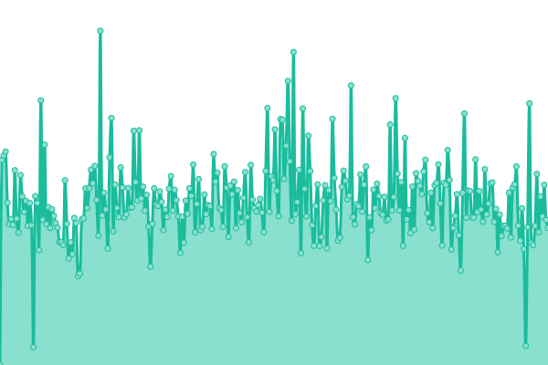

# [📈 Live Status](https://efecear.github.io/upptime): <!--live status--> **🟧 Partial outage**

This repository contains the open-source uptime monitor and status page for [efecear](https://efecear.github.io/upptime), powered by [Upptime](https://github.com/upptime/upptime).

With [Upptime](https://upptime.js.org), you can get your own unlimited and free uptime monitor and status page, powered entirely by a GitHub repository. We use [Issues](https://github.com/efecear/upptime/issues) as incident reports, [Actions](https://github.com/efecear/upptime/actions) as uptime monitors, and [Pages](https://efecear.github.io/upptime) for the status page.

<!--start: status pages-->
<!-- This summary is generated by Upptime (https://github.com/upptime/upptime) -->
<!-- Do not edit this manually, your changes will be overwritten -->
<!-- prettier-ignore -->
| URL | Status | History | Response Time | Uptime |
| --- | ------ | ------- | ------------- | ------ |
|  [efece.ar](https://www.efece.ar) | En Linea | [efece-ar.yml](https://github.com/efecear/upptime/commits/HEAD/history/efece-ar.yml) | 

 3704ms
     
 | 

<a href="https://estado.efece.ar/history/efece-ar">99.64%</a>
    

|  [Veterinaria Colonia Animal](https://www.coloniaanimal.com) | En Linea | [veterinaria-colonia-animal.yml](https://github.com/efecear/upptime/commits/HEAD/history/veterinaria-colonia-animal.yml) | 

 2282ms
     
 | 

<a href="https://estado.efece.ar/history/veterinaria-colonia-animal">100.00%</a>
    

|  [Almacenata](https://www.almacenata.com.ar) | En Linea | [almacenata.yml](https://github.com/efecear/upptime/commits/HEAD/history/almacenata.yml) | 

 3258ms
     
 | 

<a href="https://estado.efece.ar/history/almacenata">97.23%</a>
    

|  [Granja Cooperativa La Tandilera](https://www.latandilera.com.ar) | Caido | [granja-cooperativa-la-tandilera.yml](https://github.com/efecear/upptime/commits/HEAD/history/granja-cooperativa-la-tandilera.yml) | 

 0ms
     
 | 

<a href="https://estado.efece.ar/history/granja-cooperativa-la-tandilera">100.00%</a>
    

|  [Sandra Luna](https://www.sandraluna.com.ar) | En Linea | [sandra-luna.yml](https://github.com/efecear/upptime/commits/HEAD/history/sandra-luna.yml) | 

 4080ms
     
 | 

<a href="https://estado.efece.ar/history/sandra-luna">99.68%</a>
    

|  [Huella Sagrada](http://huellasagrada.com.ar) | En Linea | [huella-sagrada.yml](https://github.com/efecear/upptime/commits/HEAD/history/huella-sagrada.yml) | 

 3805ms
     
 | 

<a href="https://estado.efece.ar/history/huella-sagrada">98.12%</a>
    

|  [Almacén BioPandora](https://www.biopandora.com.ar) | Caido | [almacen-bio-pandora.yml](https://github.com/efecear/upptime/commits/HEAD/history/almacen-bio-pandora.yml) | 

 2834ms
     
 | 

<a href="https://estado.efece.ar/history/almacen-bio-pandora">98.37%</a>
    

|  [Afip Api Facturador](https://afip.dev) | En Linea | [afip-api-facturador.yml](https://github.com/efecear/upptime/commits/HEAD/history/afip-api-facturador.yml) | 

 159ms
     
 | 

<a href="https://estado.efece.ar/history/afip-api-facturador">100.00%</a>
    

|  [UTT Nodo Morón](https://www.uttnodomoron.com.ar) | Caido | [utt-nodo-moron.yml](https://github.com/efecear/upptime/commits/HEAD/history/utt-nodo-moron.yml) | 

 4685ms
     
 | 

<a href="https://estado.efece.ar/history/utt-nodo-moron">98.27%</a>
    

|  [Tierra Firme](https://www.tierrafirmenodoutt.com.ar) | Caido | [tierra-firme.yml](https://github.com/efecear/upptime/commits/HEAD/history/tierra-firme.yml) | 

 3752ms
     
 | 

<a href="https://estado.efece.ar/history/tierra-firme">99.21%</a>
    

|  [Nodo UTT Ramos Mejia](https://www.uttnodoramosmejia.com.ar) | Caido | [nodo-utt-ramos-mejia.yml](https://github.com/efecear/upptime/commits/HEAD/history/nodo-utt-ramos-mejia.yml) | 

 5261ms
     
 | 

<a href="https://estado.efece.ar/history/nodo-utt-ramos-mejia">98.67%</a>
    

|  [Vía Judicial](https://www.viajudicial.com.ar) | Caido | [via-judicial.yml](https://github.com/efecear/upptime/commits/HEAD/history/via-judicial.yml) | 

 0ms
     
 | 

<a href="https://estado.efece.ar/history/via-judicial">100.00%</a>
    

|  [Jorge Retamoza Web](https://www.retamoza.com.ar) | Caido | [jorge-retamoza-web.yml](https://github.com/efecear/upptime/commits/HEAD/history/jorge-retamoza-web.yml) | 

 2056ms
     
 | 

<a href="https://estado.efece.ar/history/jorge-retamoza-web">98.48%</a>
    

|  [Nodo Monte Castro](https://nodomontecastro.com.ar) | Caido | [nodo-monte-castro.yml](https://github.com/efecear/upptime/commits/HEAD/history/nodo-monte-castro.yml) | 

 4482ms
     
 | 

<a href="https://estado.efece.ar/history/nodo-monte-castro">97.90%</a>
    

|  [Sotero Soluciones](http://soterosoluciones.com.ar) | En Linea | [sotero-soluciones.yml](https://github.com/efecear/upptime/commits/HEAD/history/sotero-soluciones.yml) | 

 3423ms
     
 | 

<a href="https://estado.efece.ar/history/sotero-soluciones">99.71%</a>
    

|  [DNS-1](ns3.hostmar.com) | En Linea | [dns-1.yml](https://github.com/efecear/upptime/commits/HEAD/history/dns-1.yml) | 

 170ms
     
 | 

<a href="https://estado.efece.ar/history/dns-1">100.00%</a>
    

|  [DNS-2](ns4.hostmar.com) | En Linea | [dns-2.yml](https://github.com/efecear/upptime/commits/HEAD/history/dns-2.yml) | 

 170ms
     
 | 

<a href="https://estado.efece.ar/history/dns-2">100.00%</a>
    

<!--end: status pages-->

[**Visit our status website →**](https://efecear.github.io/upptime)

## 📄 License

- Powered by: [Upptime](https://github.com/upptime/upptime)
- Code: [MIT](./LICENSE) © [efecear](https://efecear.github.io/upptime)
- Data in the `./history` directory: [Open Database License](https://opendatacommons.org/licenses/odbl/1-0/)
