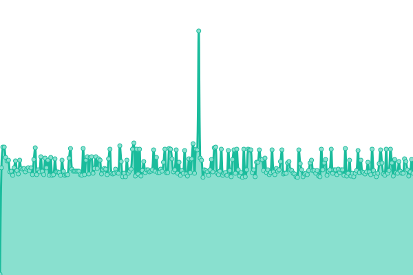

# [📈 Live Status](https://efecear.github.io/upptime): <!--live status--> **Todos los sistemas están operativos.**

This repository contains the open-source uptime monitor and status page for [efecear](https://efecear.github.io/upptime), powered by [Upptime](https://github.com/upptime/upptime).

With [Upptime](https://upptime.js.org), you can get your own unlimited and free uptime monitor and status page, powered entirely by a GitHub repository. We use [Issues](https://github.com/efecear/upptime/issues) as incident reports, [Actions](https://github.com/efecear/upptime/actions) as uptime monitors, and [Pages](https://efecear.github.io/upptime) for the status page.

<!--start: status pages-->
<!-- This summary is generated by Upptime (https://github.com/upptime/upptime) -->
<!-- Do not edit this manually, your changes will be overwritten -->
<!-- prettier-ignore -->
| URL | Status | History | Response Time | Uptime |
| --- | ------ | ------- | ------------- | ------ |
|  [efece.ar](https://www.efece.ar) | En Linea | [efece-ar.yml](https://github.com/efecear/upptime/commits/HEAD/history/efece-ar.yml) | 

 3466ms
     
 | 

<a href="https://estado.efece.ar/history/efece-ar">100.00%</a>
    

|  [Jorge Retamoza Web](https://www.retamoza.com.ar) | En Linea | [jorge-retamoza-web.yml](https://github.com/efecear/upptime/commits/HEAD/history/jorge-retamoza-web.yml) | 

 1760ms
     
 | 

<a href="https://estado.efece.ar/history/jorge-retamoza-web">91.48%</a>
    

|  [Sandra Luna](https://www.sandraluna.com.ar) | En Linea | [sandra-luna.yml](https://github.com/efecear/upptime/commits/HEAD/history/sandra-luna.yml) | 

 2953ms
     
 | 

<a href="https://estado.efece.ar/history/sandra-luna">100.00%</a>
    

|  [Huella Sagrada](http://huellasagrada.com.ar) | En Linea | [huella-sagrada.yml](https://github.com/efecear/upptime/commits/HEAD/history/huella-sagrada.yml) | 

 3915ms
     
 | 

<a href="https://estado.efece.ar/history/huella-sagrada">99.65%</a>
    

|  [Afip Api Facturador](https://afip.dev) | En Linea | [afip-api-facturador.yml](https://github.com/efecear/upptime/commits/HEAD/history/afip-api-facturador.yml) | 

 193ms
     
 | 

<a href="https://estado.efece.ar/history/afip-api-facturador">100.00%</a>
    

|  [UTT Nodo Morón](https://www.uttnodomoron.com.ar) | En Linea | [utt-nodo-moron.yml](https://github.com/efecear/upptime/commits/HEAD/history/utt-nodo-moron.yml) | 

 3556ms
     
 | 

<a href="https://estado.efece.ar/history/utt-nodo-moron">99.37%</a>
    

|  [Tierra Firme](https://www.tierrafirmenodoutt.com.ar) | En Linea | [tierra-firme.yml](https://github.com/efecear/upptime/commits/HEAD/history/tierra-firme.yml) | 

 4126ms
     
 | 

<a href="https://estado.efece.ar/history/tierra-firme">99.37%</a>
    

|  [Maia Noe](https://maianoe.com.ar) | En Linea | [maia-noe.yml](https://github.com/efecear/upptime/commits/HEAD/history/maia-noe.yml) | 

 1662ms
     
 | 

<a href="https://estado.efece.ar/history/maia-noe">99.54%</a>
    

|  [Nodo UTT Ramos Mejia](https://www.uttnodoramosmejia.com.ar) | En Linea | [nodo-utt-ramos-mejia.yml](https://github.com/efecear/upptime/commits/HEAD/history/nodo-utt-ramos-mejia.yml) | 

 5892ms
     
 | 

<a href="https://estado.efece.ar/history/nodo-utt-ramos-mejia">99.37%</a>
    

|  [Nodo Monte Castro](https://nodomontecastro.com.ar) | En Linea | [nodo-monte-castro.yml](https://github.com/efecear/upptime/commits/HEAD/history/nodo-monte-castro.yml) | 

 6572ms
     
 | 

<a href="https://estado.efece.ar/history/nodo-monte-castro">99.03%</a>
    

|  [DNS-1](ns3.hostmar.com) | En Linea | [dns-1.yml](https://github.com/efecear/upptime/commits/HEAD/history/dns-1.yml) | 

 156ms
     
 | 

<a href="https://estado.efece.ar/history/dns-1">100.00%</a>
    

|  [DNS-2](ns4.hostmar.com) | En Linea | [dns-2.yml](https://github.com/efecear/upptime/commits/HEAD/history/dns-2.yml) | 

 156ms
     
 | 

<a href="https://estado.efece.ar/history/dns-2">100.00%</a>
    

<!--end: status pages-->

[**Visit our status website →**](https://efecear.github.io/upptime)

## 📄 License

- Powered by: [Upptime](https://github.com/upptime/upptime)
- Code: [MIT](./LICENSE) © [efecear](https://efecear.github.io/upptime)
- Data in the `./history` directory: [Open Database License](https://opendatacommons.org/licenses/odbl/1-0/)
