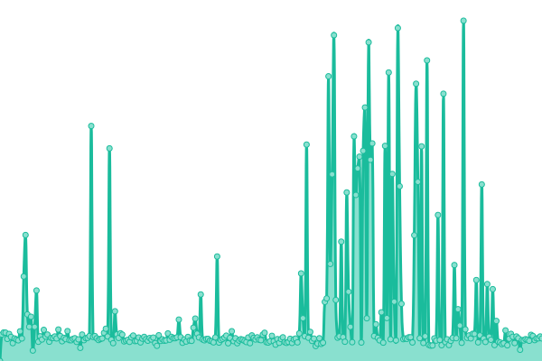
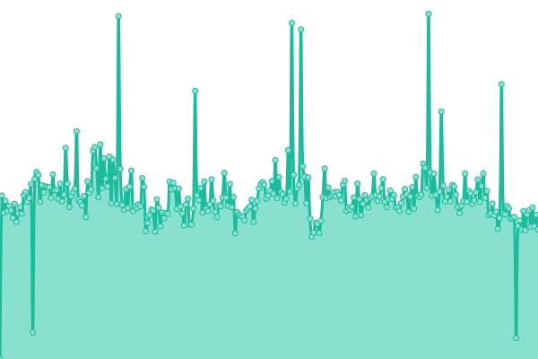

# [📈 Live Status](https://efecear.github.io/upptime): <!--live status--> **🟧 Partial outage**

This repository contains the open-source uptime monitor and status page for [efecear](https://efecear.github.io/upptime), powered by [Upptime](https://github.com/upptime/upptime).

With [Upptime](https://upptime.js.org), you can get your own unlimited and free uptime monitor and status page, powered entirely by a GitHub repository. We use [Issues](https://github.com/efecear/upptime/issues) as incident reports, [Actions](https://github.com/efecear/upptime/actions) as uptime monitors, and [Pages](https://efecear.github.io/upptime) for the status page.

<!--start: status pages-->
<!-- This summary is generated by Upptime (https://github.com/upptime/upptime) -->
<!-- Do not edit this manually, your changes will be overwritten -->
<!-- prettier-ignore -->
| URL | Status | History | Response Time | Uptime |
| --- | ------ | ------- | ------------- | ------ |
|  [efece.ar](https://www.efece.ar) | En Linea | [efece-ar.yml](https://github.com/efecear/upptime/commits/HEAD/history/efece-ar.yml) | 

 3968ms
     
 | 

<a href="https://estado.efece.ar/history/efece-ar">99.50%</a>
    

|  [Sandra Luna](https://www.sandraluna.com.ar) | En Linea | [sandra-luna.yml](https://github.com/efecear/upptime/commits/HEAD/history/sandra-luna.yml) | 

 1717ms
     
 | 

<a href="https://estado.efece.ar/history/sandra-luna">100.00%</a>
    

|  [Valentina Música](https://valentina.musica.ar) | Caido | [valentina-musica.yml](https://github.com/efecear/upptime/commits/HEAD/history/valentina-musica.yml) | 

 0ms
     
 | 

<a href="https://estado.efece.ar/history/valentina-musica">0.00%</a>
    

|  [La Semilla Que Crece](https://www.lasemillaquecrece.com.ar) | En Linea | [la-semilla-que-crece.yml](https://github.com/efecear/upptime/commits/HEAD/history/la-semilla-que-crece.yml) | 

 3494ms
     
 | 

<a href="https://estado.efece.ar/history/la-semilla-que-crece">58.73%</a>
    

|  [Maiá Noé](https://www.maianoe.com.ar) | En Linea | [maia-noe.yml](https://github.com/efecear/upptime/commits/HEAD/history/maia-noe.yml) | 

 2426ms
     
 | 

<a href="https://estado.efece.ar/history/maia-noe">100.00%</a>
    

|  [Almacén BioPandora](https://www.biopandora.com.ar) | Caido | [almacen-bio-pandora.yml](https://github.com/efecear/upptime/commits/HEAD/history/almacen-bio-pandora.yml) | 

 4506ms
     
 | 

<a href="https://estado.efece.ar/history/almacen-bio-pandora">10.31%</a>
    

|  [Abocado Cantina](https://www.abocado.com.ar) | En Linea | [abocado-cantina.yml](https://github.com/efecear/upptime/commits/HEAD/history/abocado-cantina.yml) | 

 1992ms
     
 | 

<a href="https://estado.efece.ar/history/abocado-cantina">100.00%</a>
    

|  [Almacén Reina Batata](https://www.reina-batata.com.ar) | Caido | [almacen-reina-batata.yml](https://github.com/efecear/upptime/commits/HEAD/history/almacen-reina-batata.yml) | 

 3626ms
     
 | 

<a href="https://estado.efece.ar/history/almacen-reina-batata">67.12%</a>
    

|  [Tierra Firme](https://www.tierrafirmenodoutt.com.ar) | En Linea | [tierra-firme.yml](https://github.com/efecear/upptime/commits/HEAD/history/tierra-firme.yml) | 

 3179ms
     
 | 

<a href="https://estado.efece.ar/history/tierra-firme">16.65%</a>
    

|  [Nodo UTT Ramos Mejia](https://www.uttnodoramosmejia.com.ar) | En Linea | [nodo-utt-ramos-mejia.yml](https://github.com/efecear/upptime/commits/HEAD/history/nodo-utt-ramos-mejia.yml) | 

 4101ms
     
 | 

<a href="https://estado.efece.ar/history/nodo-utt-ramos-mejia">100.00%</a>
    

|  [Nodo UTT Morón](https://www.nodouttmoron.com.ar) | En Linea | [nodo-utt-moron.yml](https://github.com/efecear/upptime/commits/HEAD/history/nodo-utt-moron.yml) | 

 6355ms
     
 | 

<a href="https://estado.efece.ar/history/nodo-utt-moron">12.22%</a>
    

|  [Vía Judicial](https://www.viajudicial.com.ar) | En Linea | [via-judicial.yml](https://github.com/efecear/upptime/commits/HEAD/history/via-judicial.yml) | 

 7235ms
     
 | 

<a href="https://estado.efece.ar/history/via-judicial">100.00%</a>
    

|  [FecaM](https://www.fecam.com.ar) | En Linea | [feca-m.yml](https://github.com/efecear/upptime/commits/HEAD/history/feca-m.yml) | 

 2984ms
     
 | 

<a href="https://estado.efece.ar/history/feca-m">100.00%</a>
    

|  [Nodo UTT Florida](https://www.nodo-florida.net.ar) | En Linea | [nodo-utt-florida.yml](https://github.com/efecear/upptime/commits/HEAD/history/nodo-utt-florida.yml) | 

 5363ms
     
 | 

<a href="https://estado.efece.ar/history/nodo-utt-florida">100.00%</a>
    

|  [Jorge Retamoza Web](https://www.retamoza.com.ar) | En Linea | [jorge-retamoza-web.yml](https://github.com/efecear/upptime/commits/HEAD/history/jorge-retamoza-web.yml) | 

 2576ms
     
 | 

<a href="https://estado.efece.ar/history/jorge-retamoza-web">100.00%</a>
    

<!--end: status pages-->

[**Visit our status website →**](https://efecear.github.io/upptime)

## 📄 License

- Powered by: [Upptime](https://github.com/upptime/upptime)
- Code: [MIT](./LICENSE) © [efecear](https://efecear.github.io/upptime)
- Data in the `./history` directory: [Open Database License](https://opendatacommons.org/licenses/odbl/1-0/)
